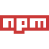
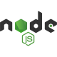

# WebStackProjects

Welcome to WebStackProjects, a curated repository featuring a 
collection of my full-stack endeavors. Dive into a showcase of 
dynamic web applications and robust online platforms that reflect 
my journey in mastering both frontend and backend development.

## Explore the Projects 

Browse through a diverse array of projects, each highlighting my 
commitment to seamless user experiences, innovative design, and 
efficient functionality. From inception to ongoing development, 
witness the evolution of my skills and the application of 
cutting-edge technologies.


Navigate through each folder to access the corresponding project 
repository. Start by opening the folder of interest, where you'll 
find a README providing project details.


```
WebStackProjects
|
├── Project1
│   ├── README.md
│   └── src
│       └── (project source files)
│
├── Project2
│   ├── README.md
│   └── src
│       └── (project source files)
│
├── Project3
│   ├── README.md
│   └── src
│       └── (project source files)
│
├── ...
│
├── README.md
└── LICENSE.md

```

## Technologies Used


These projects intricately incorporate a diverse array of 
technologies, meticulously chosen to cater to distinct facets of 
the development process. Employing advanced styling tools, the 
frontend is meticulously crafted,on the server side, robust and 
scalable backend operations are empowered by powerful frameworks.

The following tools represent the core components:


<div style="display: flex; flex-wrap: wrap; gap: 4px; ">






</div>


